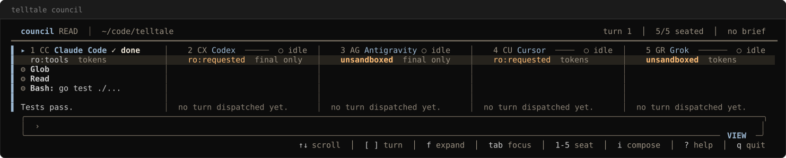
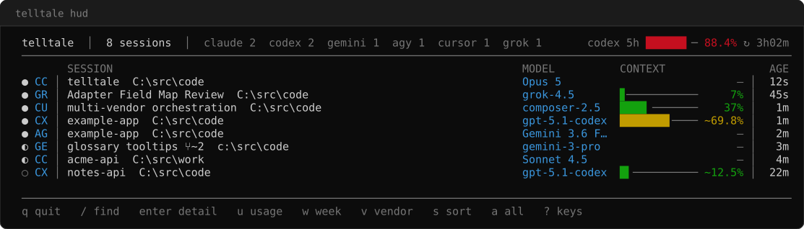

# telltale

A dispatch room for five vendor CLIs. One brief, answered side by side
by Claude Code, Codex, Antigravity, Cursor, and Grok.
A statusline and a HUD sit under the room.
Every number comes from measured tool output.

> A telltale is the ribbon on a sail. It shows the air. It does not interpret it.

[](https://github.com/sanlee-ys/telltale/actions/workflows/ci.yml)

<!-- BADGE SLOT. One rule, and it is the honest-gauge rule wearing a different
     hat: a badge states a fact somebody measured, and it names who measured it.
     The CI badge above is GitHub rendering GitHub's own run result, so it needs
     no third-party host and cannot go stale.
     Allowed here later: a directory-inclusion badge, once that listing has
     actually merged. Never here: a star count, a download count, an install
     count, or any "used by" figure — telltale measures none of them, and a
     third-party render of an unmeasured number is the badge form of a rendered
     guess. See docs/design.md §8, the 2026-08-18 amendment. -->

<p align="center">
  <picture>
    <source media="(prefers-color-scheme: dark)" srcset="images/telltale-council-dark.svg">
    <source media="(prefers-color-scheme: light)" srcset="images/telltale-council-light.svg">
    
  </picture>
</p>

<!-- HERO SLOT, for the animated capture that replaces or joins the still above.
     It is the last open piece of adoption item 1 (docs/design.md §8). Two
     conditions bind whatever lands here, and neither is negotiable by the
     session that lands it:
     1. The owner drives the eight beats. A scripted race is an invented
        recording (design.md §8, the recording chain).
     2. Every frame gets a review for workspace paths, session names and seat
        identity before the capture is committed (owner's ruling, 2026-08-17).
     The runbook is packaging/tape/README.md. No cast or GIF is in this
     repository today. -->

**v0.2.0** (2026-08-14). Windows is verified on every commit.
Intel macOS is smoke-checked. `darwin_arm64` and `linux_amd64` are built, not run.
No binary is signed. Check `checksums.txt` on the release.
Detail: [SECURITY.md](SECURITY.md). The v1 cut gates are in [docs/design.md §1](docs/design.md#s1).

## Install

**From source**

```
go build -o telltale.exe ./cmd/telltale
./telltale.exe doctor
```

A source build reports `dev` from `telltale version`. A release binary reports its tag.

**Windows, one paste** (measured against `v0.2.0`, 2026-08-18)

```powershell
irm https://raw.githubusercontent.com/sanlee-ys/telltale/main/packaging/install.ps1 | iex
```

It downloads the latest release, checks the archive against `checksums.txt`,
refuses on a mismatch, and puts `telltale.exe` on your user `PATH`.
It needs no administrator rights. The binary it installs is **not signed**,
and the script says so before it names the next command.
Source and knobs: [packaging/install.ps1](packaging/install.ps1).

**Windows, scoop** (exercised once, 2026-08-14)

```
scoop bucket add telltale https://github.com/sanlee-ys/telltale
scoop install telltale
```

**Direct download.** Each release attaches `windows_amd64`, `darwin_amd64`,
`darwin_arm64`, and `linux_amd64`, plus `checksums.txt`. Unpack one archive
and put `telltale` on `PATH`.

Measured on Intel macOS against `v0.2.0` (2026-08-17):

```
curl -fLO https://github.com/sanlee-ys/telltale/releases/download/v0.2.0/telltale_0.2.0_darwin_amd64.tar.gz
curl -fLO https://github.com/sanlee-ys/telltale/releases/download/v0.2.0/checksums.txt
shasum -a 256 -c checksums.txt --ignore-missing
tar -xzf telltale_0.2.0_darwin_amd64.tar.gz
./telltale doctor
```

A browser download on macOS sets `com.apple.quarantine`. After the checksum
passes, run `xattr -d com.apple.quarantine telltale`. Do not add that line
to the `curl` block: `curl` does not set the mark, and the command then
exits 1. The measured walk is in [SECURITY.md](SECURITY.md).

**Windows, winget.** Not submitted. Use the one paste above, scoop, or a
source build. Draft: [packaging/](packaging/).

Run `telltale` with no arguments for the first frame.
`telltale doctor` is the preflight. `telltale council` opens the room.

Wire the statusline into Claude Code (`~/.claude/settings.json`):

```json
{
  "statusLine": {
    "type": "command",
    "command": "C:\\path\\to\\telltale.exe statusline"
  }
}
```

The same block works for Antigravity CLI
(`~/.gemini/antigravity-cli/settings.json`). telltale reads the vendor
from the payload `product` field.

Cursor CLI (`~/.cursor/cli-config.json`) needs `--vendor cursor`.
Its payload has no vendor name. This statusline is interactive only
(measured; [docs/design.md §7.16](docs/design.md#s7-16)):

```json
{
  "statusLine": {
    "type": "command",
    "command": "C:\\path\\to\\telltale.exe statusline --vendor cursor"
  }
}
```

Then start an interactive `cursor-agent` session and run `telltale hud`.

Wire the MCP server into a client once, so an agent can read the fleet:

```
claude mcp add telltale -- C:\path\to\telltale.exe mcp
```

<p align="center">
  <picture>
    <source media="(prefers-color-scheme: dark)" srcset="images/telltale-hud-dark.svg">
    <source media="(prefers-color-scheme: light)" srcset="images/telltale-hud-light.svg">
    
  </picture>
</p>

The test suite emits that picture from the HUD render.
Empty cells are fields no vendor writes. A `~` marks an estimate.
`↑`/`↓` move the selection. `enter` opens the detail pane. `/` filters rows.

HUD flags: `--vendor all|claude|codex|gemini|agy|cursor|grok`,
`--hide gemini,cursor` (default from `TELLTALE_HUD_HIDE`),
`--ascii` (`TELLTALE_ASCII=1`), `--no-title`. `NO_COLOR` is honoured.

## First five minutes

Run `telltale doctor` first. It reports what is installed here, it probes no
login and makes no network call, and it **exits 0 even when every seat is
missing**. Read its own words before you read this table: each row below is
keyed to a line `doctor` actually prints.

| What you see | What it means | What to do |
|---|---|---|
| `0 checks passed`, and `no seat above passed every check that ran` | telltale is working. `council` drives a vendor CLI, and this machine has none. | Install one vendor CLI and run `doctor` again. `telltale hud` runs either way. |
| `binary FAILED  not found on PATH (looked for codex)` | This shell cannot resolve that vendor. | Open the shell you normally run the vendor in, or put its binary on `PATH`. `doctor` also finds a vendor at a known install location and says `a known install location, not on this shell's PATH`. |
| `drivable FAILED` under a `binary ok` | The binary is here and council will not seat it. "Is it there" and "can it be driven" have different fixes, so `doctor` refuses to collapse them. | Read the reason on that row. It names the entry point and why: usually a shell shim that takes its prompt as an argument, which council will not put through `cmd.exe`. |
| `auth  not checked` and `network  not checked`, on every seat, always | Not a failure and not a soft pass. This report probes neither. | Nothing. A seat that is installed and signed out reports its own auth failure on its column the first time you dispatch to it. |
| `re-measure §3.x before trusting the fields this adapter sources` | Your vendor runs a version other than the one telltale surveyed. | Nothing on this machine. It is a staleness fact about telltale: no check failed, the tally is unchanged, and the command still exits 0. |
| `telltale version` says `dev`, or an older tag, after the install | Another `telltale.exe` is earlier on `PATH`. The install script appends its directory rather than jumping the queue. | Run `Get-Command telltale`. It names the one that runs. Remove the other one, or set `TELLTALE_INSTALL_DIR` to the directory it already lives in. |
| A column in the room stays empty after a dispatch | The seat answered nothing, or the vendor refused the turn. | The column carries the reason. [docs/council.md](docs/council.md) reads the badges and the phase words. |
| Windows warns before the first run | The binary is unsigned. No telltale release carries an Authenticode signature ([docs/design.md §8](docs/design.md#s8), item 8). | Verify the archive against `checksums.txt`, which is the whole verification this release offers. [SECURITY.md](SECURITY.md) states what that does and does not prove. |
| The statusline shows nothing, or `bad statusline input: unexpected end of JSON input` | The statusline is wired, not run. The vendor calls it and hands it JSON on stdin, so by hand it gets no payload. | Paste the `statusLine.command` block above, then start a session. |

`telltale doctor` output pastes into an issue as it stands: it is plain text
with no colour and no alternate screen, for exactly that reason.

## What it is

- **`telltale council`:** one brief, five vendor columns. This is the product.
- **`telltale statusline`:** model, context, session cost, and quota pacing
  from the JSON the vendor sends on stdin. No network. No credential read.
- **`telltale hud`:** a watch TUI over Claude Code, Codex, Gemini CLI,
  Antigravity CLI, Cursor (Composer), Grok CLI, and Pi.
- **`telltale snapshot`:** the same scan as JSON, for a program.
- **`telltale mcp`:** the same document over MCP on stdio, for an agent.
- **`telltale doctor`:** which vendor binaries this machine has.
- **`telltale events`** / **`telltale events view`:** a loopback hook sink
  and its reader.
- **`telltale hook`** / **`telltale otel`:** relays that write per-turn
  token totals under `~/.telltale/`. They print nothing.
- A documented adapter interface, plus a drop-file relay for a tool with
  no adapter. Spec: [docs/dropfile.md](docs/dropfile.md).

Gauges read vendor files on this machine. They make no network calls.
They write keys and numbers under `~/.telltale/` only.
`telltale council` is the one mode that starts vendor CLIs.
The Cursor store holds tokens in the same SQLite file as session state.
The adapter does not read them. [SECURITY.md](SECURITY.md) states the
boundary.

## The dispatch room

```
telltale.exe council
```

An unaddressed brief goes to Claude. `@codex`, `@agy`, `@cursor`,
`@grok`, and `@all` route a turn. `-@claude` addresses every seat but
that one. `--read` opens a room that only talks. `--cd` sets the
workspace. A plain `telltale council` can write, and the header says so.

[docs/council.md](docs/council.md) is the room guide: badges, routing,
keys, and flags. [docs/design.md §9](docs/design.md#s9) is the measured
record per vendor.

## `telltale snapshot`

```
telltale.exe snapshot
```

One scan, one JSON document on stdout, exit 0. Flags: `--vendor <id>`,
`--compact`, `--timeout <dur>` (default 10s). An unknown flag or vendor
prints no document.

| the document says | it means |
|---|---|
| `"cost_usd_total": 0` | measured zero |
| `"cost_usd_total": null` | no reading right now |
| `"unsupported": ["cost"]` | this vendor never exposes that field |
| `"estimated": ["context_pct"]` | the adapter computed the value |
| `"quota": []` | no relayed account reading |

The document holds numbers and keys. It holds no session names, paths,
or reply text. Schema: [docs/design.md §7.22](docs/design.md#s7-22) and
[docs/snapshot.schema.json](docs/snapshot.schema.json).

[`tools/fleet-prompt.ps1`](tools/fleet-prompt.ps1) is one consumer:

```
. .\tools\fleet-prompt.ps1
Get-TelltaleFleetLine
```

## `telltale mcp`

```
claude mcp add telltale -- <path>\telltale.exe mcp
```

The same document, served to an agent over the Model Context Protocol on
stdio. You do not type this command: an MCP client starts it. One tool,
`fleet_snapshot`, takes an optional `vendor` argument and returns the
document above — the same bytes, so every rule in that table holds here.
One flag: `--timeout <dur>` (default 10s), per call.

It speaks stdio only. It binds no port, calls no network, and writes
nothing. [docs/design.md §7.25](docs/design.md#s7-25) states the surface
and what is not verified.

## `telltale events`

```
telltale.exe events
telltale.exe events view
```

One hook event per POST on loopback, appended under `~/.telltale/events/`
and rebroadcast on `/stream`. Default bind: `127.0.0.1:4519`. Any other
host is refused. This store holds payload content.
`telltale events view` reads the files. No gauge reads them.
Flags and the boundary: [docs/design.md §7.21](docs/design.md#s7-21).

## `telltale doctor`

```
telltale.exe doctor
```

Which vendor binaries are on this machine, where each one was found, and
what version each one reports. Auth and network always read `not checked`.
The command runs `<binary> --version` and writes nothing.

## The honest-gauge rule

A segment may only display a value read from tool or vendor output.
Anything inferred is omitted or marked as an estimate.
A gauge that cannot tell "no data" from "zero" fails the build.
`internal/hud` renders one session at 0% and one session with no context
source, and asserts the two rows differ.

Fixtures are synthesized. This repository holds no real session content.

## Design

- [docs/council.md](docs/council.md): the room in use
- [docs/design.md](docs/design.md): segments, adapters, HUD, council record
- [STATE.md](STATE.md): what is in flight
- [PARITY.md](PARITY.md): what differs across machines
- [SECURITY.md](SECURITY.md): trust model, signing, checksums

## License

MIT
